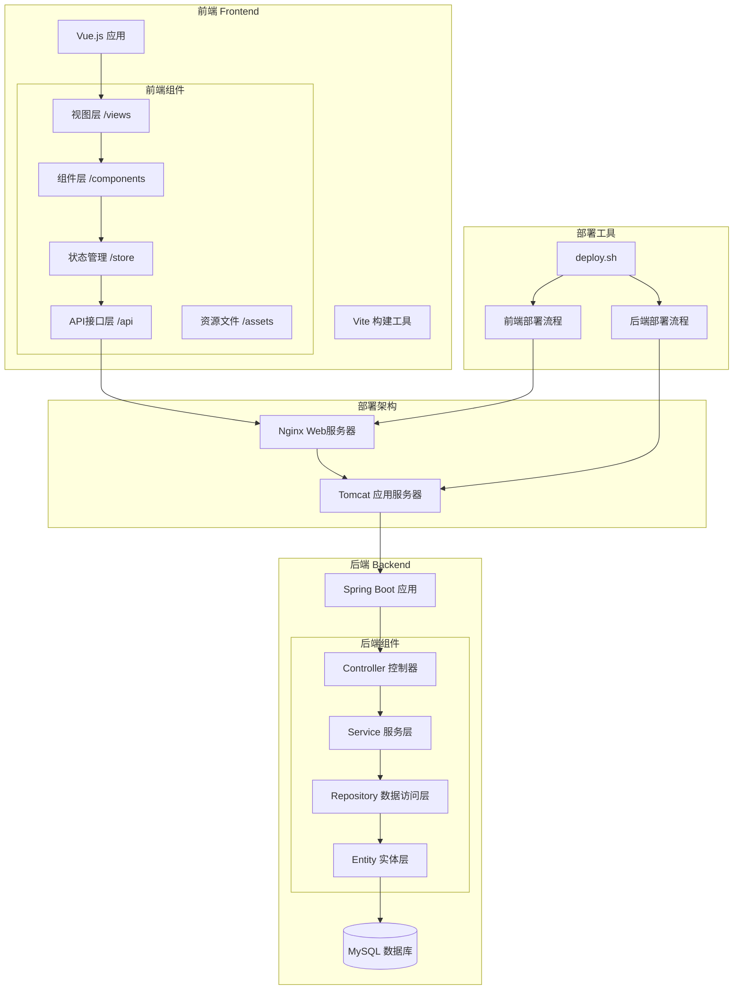

# 牛津词汇应用架构设计

## 系统架构图

## 架构说明

### 1. 前端架构
- 使用 Vue.js 作为前端框架
- 采用 Vite 作为构建工具
- 主要目录结构：
  * `/views`: 页面视图组件
  * `/components`: 可复用组件
  * `/store`: 状态管理
  * `/api`: 后端接口调用
  * `/assets`: 静态资源

### 2. 后端架构
- 基于 Spring Boot 框架
- 采用标准的多层架构：
  * Controller 层：处理 HTTP 请求
  * Service 层：业务逻辑处理
  * Repository 层：数据访问
  * Entity 层：数据模型

### 3. 部署架构
- Nginx：作为前端静态资源服务器和反向代理
- Tomcat：运行 Spring Boot 后端应用
- MySQL：数据存储

### 4. 部署工具
- `deploy.sh` 脚本支持：
  * 前端独立部署
  * 后端独立部署
  * 前后端同时部署

### 5. 网络架构
- 前端访问地址：`http://124.223.76.88/`
- 后端 API 地址：`http://124.223.76.88/oxford-vocabulary/api/`
- Nginx 配置：
  * 静态资源：`/var/www/html/`
  * API 转发：`/oxford-vocabulary/api/` 